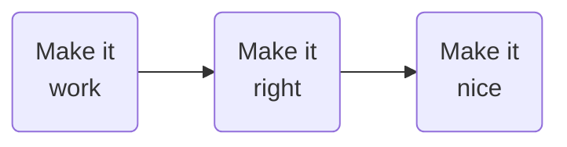

## Installation of the project
you will find in `scripts` :
|     File name     |                             Fucntion                              |          Example of use           |
| :---------------: | :---------------------------------------------------------------: | :-------------------------------: |
| initialization.sh |          creates a vhost and a directory for the project          | `./initialization.sh projectName` |
|  installation.sh  | clones the repository and  installs the dependances with composer | `./installation.sh projectName` |
# PHP Technical Interview
## Subject
### Goal
Build a mini website using PHP8.3-FPM and Bootstrap to display data from the FakeStoreAPI, with the following pages:
1. **Homepage**: Slider, products from one category, and a list of categories.
2. **Product Listing Page**: List of products filtered by category.
3. **Product Detail Page**: Detailed view of a single product with options for sorting, filtering, and searching.

### Constraints
- Use PHP8.3-FPM.
- Use Bootstrap for CSS (minimal custom CSS).
- The FakeStoreAPI calls should be handled by PHP (not exposed to the client).
- Source code should be available on a public GitHub repository with feature-based commits.
- Mobile-first design.
- Total development time should not exceed ~20 hours.

### Understanding the subject
As I understand the subject I am supposed to show how i can manage to implement :
- filters for the products shown on a page
- responsive slider for mobile use
- a nice page t oshow the details of one product

As the subject gives a few informations i took the opportunity to consider it a a 'carte blanche' on some features.

I will make :
- a **Homepage** showing
  - a list of products with potential filters
        
        this is what i understand of "products from one category, and a list of categories"
- a **Product Listing Page** showing
    - all the products from one category
    - a responsive slider / flexbox show

- a **Product Detail Page** showing
    - all the informations there is about a product
## How i intend to do it
### Timing
I started to work a few minutes ago on Monday the 29th of july 2024 around 16h20.

I have a few days off, which i intend to delegate to this work. I start with an overview of how i planned to work.

I will spend a few hours today working on the project initialization.
Additionaly , i will work 2 full days tomorrow (tuesday) and the day after tomorow (wenesday) for a total of ~ 20h.

I intend to make an aditional documentation at the end of the project to give a feedback about how it went. I wiil not count this as "working time" as it is supposed to be dedicated to the feedback.

### Initial configuration
I have a Windows 10 personal computer on which i installed today Oracle VirtualBox.

I work on a virtual machine running ubuntu 22.04.

I used a script `scripts/initialization.sh` I made a few weeks ago (for another excercice) to install PHP8.3-FPM and Apache2 on the VM. (you will find the scripts i made in `scripts/`)

### Methodology

#### Setting a workflow
I intend to spend some time working on the network interface to be able to access the VM's "website" from the host. It will provide a much more confortable workspace as i have a rather small screen dedicated to the VM.

#### The initial state
The script i used sets up a vhost and the file system to start working on an RMVC structure.
By running the script I only have an `index.php` in the `src/` directory.

#### Fetching data
##### first time
I will have to find out how to fetch data from a api using only PHP code. For now i always used JS code to request API.

In all the php exercices I had to work on i had a mariaDB database running on the host.
##### testing
I will have to test the "APIcontroller" for multiple endpoints.

#### Setting up a good file system
I know the FS implemented by my original script is not a very good pratice so i will try to make it better by setting up a `public/` directory to separate sensitive contents from the front controller.

#### Routing
When the controller and the view for a feature are ready I will add the route to the router.

#### Build the views
I will start with really simple views , just showing the raw data.

I will create some layouts for head, header and footer.
Then I will add the Bootstrap 5 cdn.
Later I might add a proper installation of Bootstrap.

#### Add style

## Result

### Feedback
I am pretty proud of what i achieved considering the given time and constraints.

### Timing
I worked with a lot of interuptions due to the fact that I am on "vacation" with my family.

The table below displays the sessions of work i spent on this project.

| day | session | hours | topic |
| :---: | :---: | :---: | :---: |
| 29/07/2024 | 16h30 - 22h00 | ~5h30 | setting up the work flow and major features like homepage |
| 30/07/2024 | 12h00 - 22h30 | ~10h30 | product detailed page |
| 31/07/2024 | 12h00 - 13h30 | ~1h30 | make home page look nice |
| 31/07/2024 | 14h00 - 16h00 | ~2h00 | update doc and installation script |

I spent a total of 19h30 on this project.

### Discution
| Page | Features in subject | Features in delivery | Features to add |
| :-: | :-:| :-:| :-:|
| Homepage |  Slider    Products from one category   List of categories   | List of products filtered by category    List of categories    options for filtering   Products from one category|  Slider    options for sorting and searching  |
| Product Listing Page | List of products filtered by category  |  Slider    Products from one category|  filters  |
| Product Detail Page | Detailed view of a single product    options for sorting, filtering and searching | Detailed view of a single product| options for sorting, filtering and searching |

### Improvement
There is still a lot to do :
- most of the site is in english but some features are still in french (I noticed it at the end)
- the JS script for the filters on the home page should be in a separated file
- the installation script is just a raw shell script (could be an Ansible idempotent script)

As it wasn't requested , there is no form management in this project. To my aprasiation, it would have been the next step.